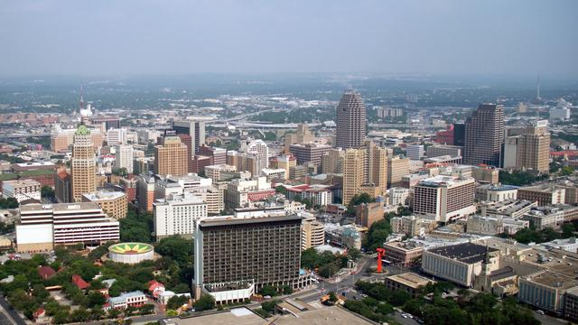

__Civil Services__ is a collection of tools that make it possible for citizens to be a part of what is happening in their Local, State & Federal Governments.

City Council Data for San Antonio, TX
===

  

Introduction
---

This project provides the City Council Data, Headshots & City Photo for San Antonio, TX ( JSON, XML, CSV, SQL & YML formats ).  See [Provided Data](#provided-data) below for full list of data in this project.

Completed Tasks
---

We have completed the following Data Collection for San Antonio, TX. [Watch Project](https://github.com/CivilServiceUSA/city-council-tx-san-antonio/subscription) to be notified of updates.

- [X] City Council Data Created
- [X] City Photo Created
- [X] Councilor Headshots Created
- [X] Images Uploaded to CDN
- [X] GeoJSON File Created
- [ ] Published NPM Package

Maintaining Data
---

This City Council Data is maintained in a Google Spreadsheet.  This data can be updated by the general public, and we will be notified when any change occurs.  So, if you see something wrong, just go ahead and fix it and we'll get a notice of the change.

You will want to use [San Antonio's Official City Council Website](https://www.sanantonio.gov) to populate this data. However, they may not have 100% of what we collect, so Google is your friend there :)

### [☑ Manage City Council Data](https://docs.google.com/spreadsheets/d/1KA4HICbMD4N0U0SRm-Uc_xzzZ_-cazaklHWe1FZ7-o8/edit#gid=0)

Provided Data
---

Parameter             | Type   | Description
----------------------|--------|----------------
`state_code`          | string | Two Letter State Abbreviation
`city_name`           | string | Name of City
`city_slug`           | string | Name of City converted to lowercase letters and spaces replaced with dashes
`city_population`     | string | Population of City
`city_website`        | string | Official Website of City
`city_background_url` | string | Creative Commons Image you can use for City
`public_records`      | string | URL to Public Records ( not always available )
`latitude`            | string | GPS Latitude of City
`longitude`           | string | GPS Longitude of City
`district`            | string | District of Councilor ( not always available )
`at_large`            | string | At-Large of Councilor ( not always available )
`name`                | string | Full Name of Councilor
`name_slug`           | string | Full Name of Councilor converted to lowercase letters and spaces replaced with dashes
`first_name`          | string | First Name of Councilor
`last_name`           | string | Last Name of Councilor
`gender`              | enum   | Gender of Councilor
`ethnicity`           | enum   | Ethnicity of Councilor
`date_of_birth`       | string | Date of Birth of Councilor
`title`               | enum   | Title of Councilor
`party`               | enum   | Political Party of Councilor
`email`               | string | Work Email Address of Councilor
`phone`               | string | Work Phone Number of Councilor
`address`             | string | Work Mailing Address of Councilor
`twitter_url`         | string | Twitter URL of Councilor ( not always available )
`facebook_url`        | string | Facebook URL of Councilor ( not always available )
`photo_url`           | string | Photo URL of Councilor ( not always available )

* `city_background_url` is available in the following sizes: 640x360, 960x540, 1280x720 & 1920x1080 ( defaults to 1280x720 )
* `city_photo_url` is available in the following sizes: 64x64, 128x128, 256x256, 512x512 & 1024x1024 ( defaults to 512x512 )
